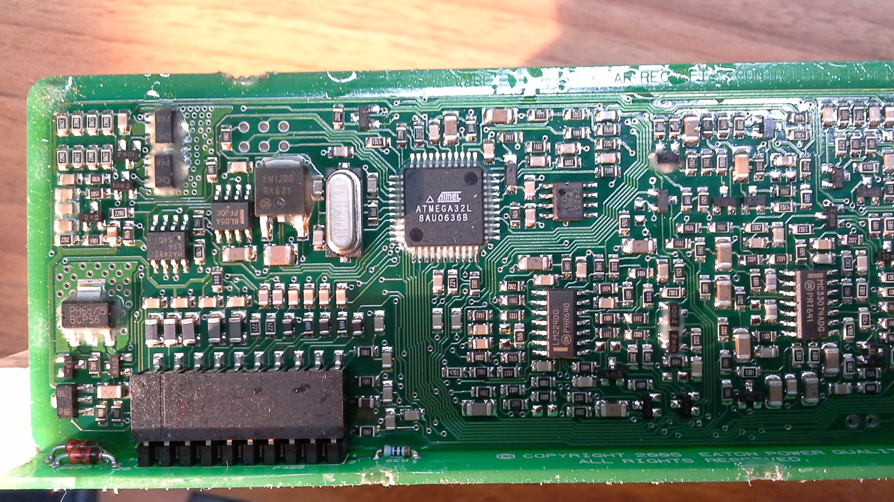

# EatonAPR48
This is a [SweetScape 010Editor's](https://www.sweetscape.com/010editor/repository/templates/file_info.php?file=EatonAPR48.bt&type=0&sort=) script for exploring and modifying Eaton APR48 power supply's EEPROM structure (in order to be able to change the output voltage). 

Note that Eaton APR48 is an older version of Eaton APR48-3G power supply.

# Usage

You need to have 010Editor installed to use this script. Then follow the steps 
1. File|Open File... -> EatonAPR48_EEPROM_145294054_copy.bin
2. Template|Open Template... -> EatonAPR48.bt
3. Template|Run Template
4. Expand **the first** _struct EatonEEPROMParams_ and change the _outputVoltage_.
5. File|Save As... -> EatonAPR48_EEPROM_145294054_56V_23A.bin
   
   File|Save As... -> EatonAPR48_EEPROM_145338245_56V_23A.bin
6. ```
   srec_cat EatonAPR48_EEPROM_145294054_56V_23A.bin -binary -o EatonAPR48_EEPROM_145294054_56V_23A.hex -intel
   srec_cat EatonAPR48_EEPROM_145338245_56V_23A.bin -binary -o EatonAPR48_EEPROM_145338245_56V_23A.hex -intel
   ```
7. `"C:\Program Files (x86)\khazama.com\Khazama AVR Programmer\Khazama AVR Programmer.exe"`
   ```
   Command | Read Chip Signature -> 0x1e9502
   Command | Read EEPROM to Buffer
   Command | Verify EEPROM
   File | Load EEPROM File to Buffer
      EatonAPR48_EEPROM_145294054_56V_23A.hex
      EatonAPR48_EEPROM_145338245_56V_23A.hex
   Command | Write EEPROM Buffer to Chip
   ```


# Hardware

This is from _[APR48_APU48_E_Letter.pdf](http://lit.powerware.com/ll_download.asp?file=APR48_APU48_E_Letter.pdf):_

The APR48 has a 1500W output and it is designed for operation at up to 70°C (158°F) 
and under a wide range of AC power conditions.

- Input
    - AC Supply
    - APR48: 220/240V, 50/60Hz (nominal)
        - 185-275V full output power up to 50°C [122°F]
        - 150-185V full output power up to 30°C [86°F]
    - Power Factor: >0.99 (50 – 100% Output Current)
    - Efficiency: 90% (50 – 100% Output Current)

- Output
  - DC Output Voltage Range     48V: 43 – 57.5V
  - DC Output (maximum)         APR48: 1500W, 31A @ 48V

- Environmental
    - Operating Temperature Range: -40°C – +70°C [-40°F – +158°F]
        - Output current is derated above 50°C [122°F] and below -10°C [14°F]
    - Cooling: Temperature controlled, high reliability fans

- Mechanical
    - Dimensions (H,W,D overall): 133mm [5.25”], 13E: 66mm [2.6”], 257mm [10.1”]
    - Weight: 1.9kg [4.2lb ]

A helpful reverse engineering reference can be found [here](https://electrotransport.ru/ussr/index.php?topic=21127.msg490810#msg490810) and here [here](https://endless-sphere.com/forums/viewtopic.php?f=2&t=66169#p995130). They deal with the APR48-3G model whose EEPROM structure is slightly different than APR48.

## APR48 Innards





For the pictures of the assembled power supply see [here](https://endless-sphere.com/forums/viewtopic.php?t=93764) and [here](https://imgur.com/a/TzfKa).


